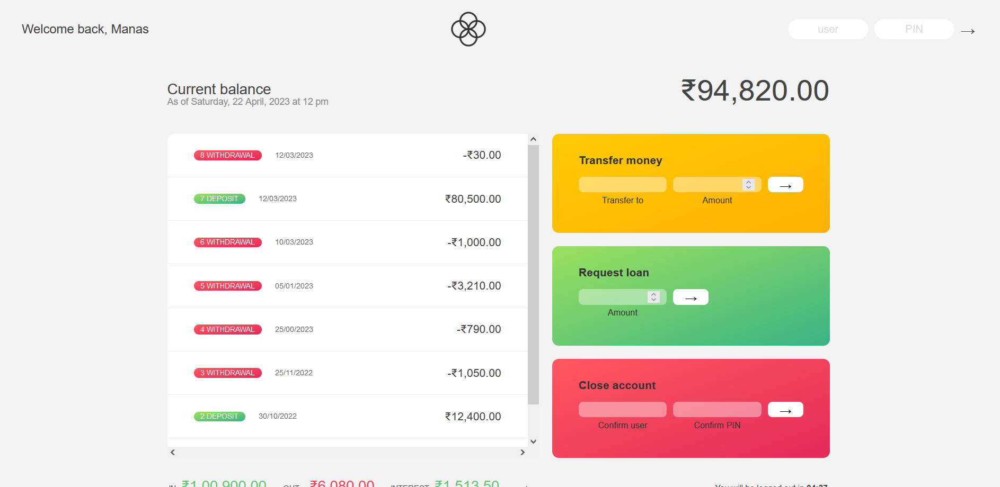

# Bankinst-app

This is a simple bankist app I just made after learning some JavaScript from Jonas Schmedtmann's course.

- [👉Live Preview👈](https://manas-shinde.github.io/Bankist-App/)

### Built with

- Semantic HTML5 markup
- CSS custom properties
- Javascript
- Flexbox
- Grid

## Test Username and PIN

Username: js 
PIN: 1111 

username: jd 
PIN: 3333 

username: ms 
PIN: 9999 

#### Screenshot

#### Flowchart

